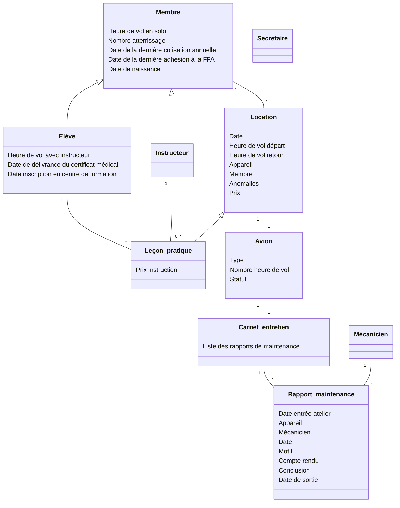

# Projet de gestion d'un club de vol

Représentation conceptuelle

```mermaid
classDiagram

Membre <|-- Elève
Membre <|-- Instructeur
Location <|-- Leçon_pratique

Instructeur "1" -- "0..*" Leçon_pratique
Elève "1" -- "*" Leçon_pratique
Location "1" -- "1" Avion
Avion "1" -- "1" Carnet_entretien
Mécanicien "1" -- "*" Rapport_maintenance
Carnet_entretien "1" -- "*" Rapport_maintenance
Membre "1" -- "*" Location

class Avion {
    Type
    Nombre heure de vol
    Statut
}

class Elève {
    Heure de vol avec instructeur
    Date de délivrance du certificat médical
    Date inscription en centre de formation
}

class Membre {
    Heure de vol en solo
    Nombre atterrissage
    Date de la dernière cotisation annuelle
    Date de la dernière adhésion à la FFA
    Date de naissance
}

class Secretaire

class Carnet_entretien {
    Liste des rapports de maintenance
}

class Rapport_maintenance {
    Date entrée atelier
    Appareil
    Mécanicien
    Date
    Motif
    Compte rendu
    Conclusion
    Date de sortie
}

class Location {
    Date
    Heure de vol départ
    Heure de vol retour
    Appareil
    Membre
    Anomalies
    Prix
}

class Leçon_pratique {
    Prix instruction
}

```
